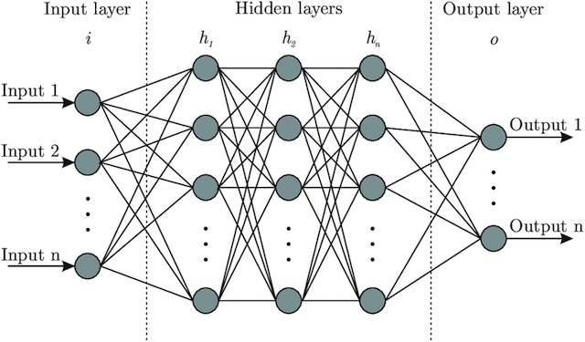
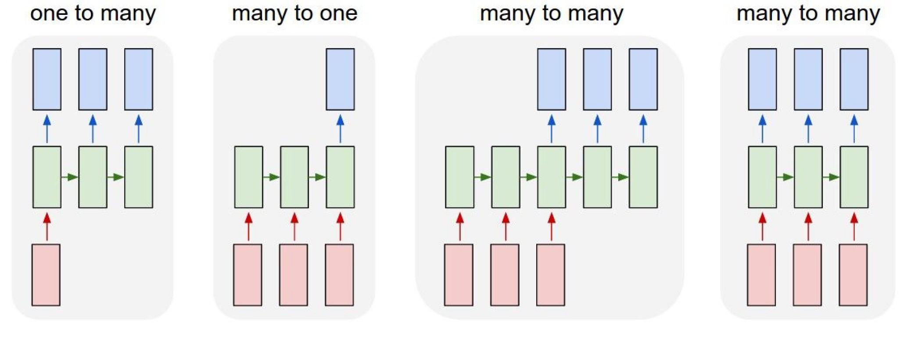
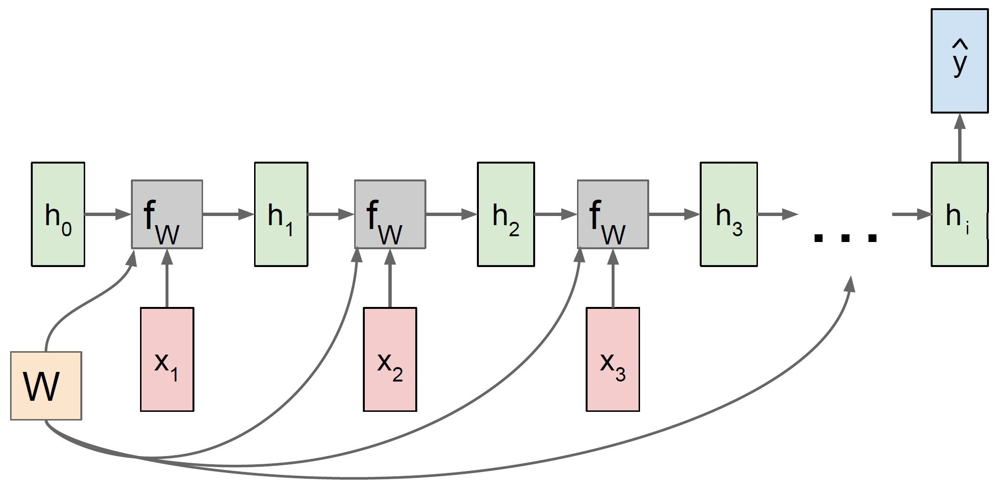

## 2. Theory {#theory}

In the next sections, the two types of neural networks used in this paper are presented. 

### 2.1. Multilayer perceptron (MLP) {#MLP}


Multilayer perceptrons (MLP) are widely used feedforward neural network models and make usage of the backpropagation algorithm. They are an evolution of the original perceptron proposed by Rosenblatt in 1958 [@perceptron_paper]. The distinction is that they have at least one hidden layer between input and output layer, which means that an MLP has more neurons whose weights must be optimized. Consequently, this requires more computing power, but more complex classification problems can be handled [@mlp_architecture]. Figure \ref{fig:mlp_schema} shows the structure of an MLP with $n$ hidden layers. Compared to the perceptron, it can be seen that this neural network consists of an input layer, one or more hidden layers, and an output layer. In each layer, there is a different number of neurons, respectively nodes. These properties (number of layers and nodes) can be summarized with the term 'network architecture' and will be dealt with in this thesis.

```{r mlp_schema, fig.align='center', out.width='60%', fig.cap='Schematic diagram of a multilayer perceptron', echo=FALSE}


# https://assets.website-files.com/5ac6b7f2924c652fd013a891/5edab65ea64212da0ad611b7_5d52f096076d2b058e88cf0c_Artificial-neural-network-architecture-ANN-i-h-1-h-2-h-n-o.jpeg
```

Every neural network has an input layer, which consists of one or more nodes. This number is determined from the training data and tells us how many features should be delivered to the neural network. In the case of bitcoin prices, we could use today's price and the prices of the last 10 days (lags 1-10), so the input layer would consist of 11 nodes. Some configurations also require a bias term to adjust the output along with the weighted sum, which is also added to the input layer. In contrast to the scheme of the MLP, this setup can be seen in figure \ref{fig:perceptron_schema} where the bias term is defined as 'constant'. Similarly to the input layer, each neural network has exactly one output layer. This can consist of one or more nodes. In this thesis, MLP is used as a regressor and therefore only one neuron is needed in this layer.

In between are the hidden layers, whose number and size can be configured as desired. The challenge is to find an optimal and efficient configuration without causing overfitting of the training data. The number of hidden layers depends primarily on the application area of the neural network. For example, working with image recognition would require more layers since the image file is broken down into individual pixels. Subsequently, the layers are used to optimize from rough outlines to the smallest detail. In our research, we came across several methods or 'rules of thumb' to optimize the model. A frequently suggested method is explained by Andrej Karpathy (director of the AI department of Tesla, Inc.). His GitHub entry recommends the approach of starting with a model that is too large that causes overfitting. Subsequently, the model is reduced by focusing on increasing training loss and improving validation loss [@recipe_training].

### 2.2. Recurrent neural networks (RNN) {#RNN}


Recurrent neural networks (RNN) are a further development of conventional neural networks. While MLP use new inputs $x_i$ in each epoch, RNN also use sequential data $h_i$ in addition to $x_i$. This sequential data are called hidden states and result from the previous runs. This has the advantage that historical information stemming from past predictions is included for the prediction for $t+1$. This effect can be intuitively explained by an example in which the flight path of a scheduled flight is predicted using RNN. When predicting the exact location (coordinates) of a plane, it is of great advantage to know the location at $t-1$ and to derive the flight direction from it. With the inclusion of this information, the target area can be narrowed down, which optimally leads to more accurate results. The same principle is used in applications like machine translation and speech recognition, where the result (here possibly letter or word) of the last epoch plays a big role for the next prediction [@RNN].

```{r RNN, fig.align='center', out.width='80%', fig.cap= 'Process sequences of different applicances of RNN.', echo=FALSE}



#[1]F.-F. Li, J. Johnson, and S. Yeung, ‘Lecture 10: Recurrent Neural Networks’, p. 105.

```

Figure \ref{fig:RNN} shows different process sequences of the RNN, which vary depending on the field of application. The red rectangles at the bottom represent the number of inputs. Similarly, the blue rectangles represent the outputs that come out of the RNN. The term 'many' refers to $>1$ and is illustrated with three rectangles in the figure. The green ones represent the hidden states $h_i$ of all time steps and thus can be seen as the memory of the neural network. The green arrows show that the previous hidden state is used as input for the current step. Starting from the left: one-to-many can be used for image captioning (extracting sequence of words from images), many-to-one for sentiment classification from sequence of words, many-to-many for machine translation (sequence of words in one language to sequence of words in another language) and many-to-many for video classification on frame level [@RNN_Stanford]. For the prediction of the BTC/USD exchange rate in this paper, we deal with the process many-to-one. This method combines information from inputs and hidden states into one single prediction value. 

```{r RNN_many_to_one, fig.align='center', out.width='70%', fig.cap= 'Computational graph of a many-to-one RNN.', echo=FALSE}



#[1]F.-F. Li, J. Johnson, and S. Yeung, ‘Lecture 10: Recurrent Neural Networks’, p. 105.

```

```{=tex}
\begin{align} \label{eq:RNN_many_to_one_1}
  h_{i} & = f_{W}(h_{i-1}, x_{i}) \\
  & = \tanh(W_{h}h_{i-1} + W_{x}x_{i} + b) \nonumber 
\end{align}
```

Equation \ref{eq:RNN_many_to_one_1} shows how the hidden states $h_{i}$ are calculated at each time step, $i$ where $f_{W}$ is an activation function (here: hyperbolic tangent function), $h_{i-1}$ is the previous state and $x_i$ is the input vector at time step i. In some cases, a bias term $b$ is added to the parameters. $W_{h}$ represents the weight matrix for $h_{i}$ with dimension (length($h$)$\times$length($h$)). Thus, $W_{x}$ is the weight matrix for $x_{i}$ with dimension (length($h$)$\times$length($x$)).

```{=tex}
\begin{align} \label{eq:RNN_many_to_one_2}
  \hat{y_{i}} = W_{y}h_{i}
\end{align}
```

Looking at equation \ref{eq:RNN_many_to_one_2}, $y_{i}$ equals the output and desired prediction of the RNN. The prediction results from the matrix-vector product of the weight matrix $W_{y}$ with dimension (length($h$)$\times$length($y$)) and the hidden states vector $h$.