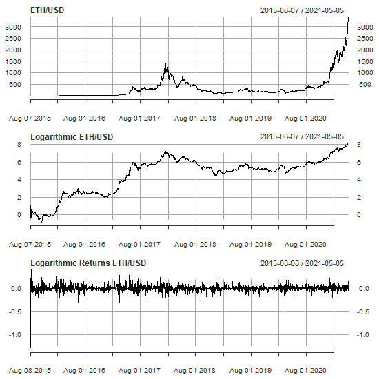
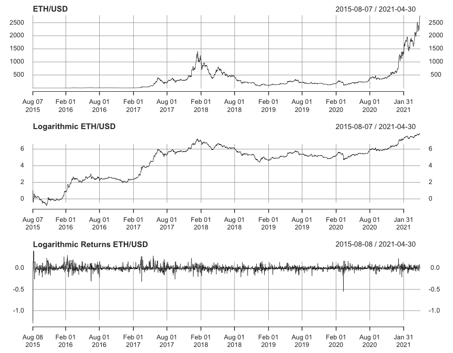
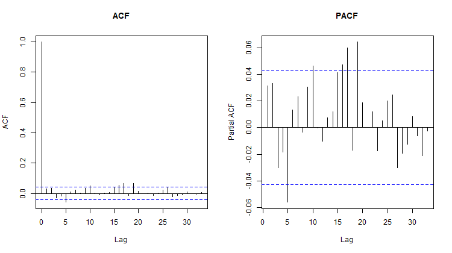

## 3. Methods {#methods}

This section covers how to define a trading strategy from the trained networks. It is also dedicated to the topic of how the performance is evaluated.

### 3.1. Data exploration

First, we will explore the the development of ETH over time. Figure \ref{fig:eth_exploration} shows the price, the logarithmic price and the log return. The logarithmic price is used to better compare the changes from the price as the relative change becomes visible. The same is true for the log return which shows stationarity. In the first two plots the local peaks are well visible, which reached a then ATH (All-Time High) of USD 1313 in January 2018. It can also be seen that we are in a bull run at the time of writing this paper. In the log return, it can be seen that the volatility is not constant and thus shows volatility clusters.


```{r eth_exploration, fig.align='center', out.width='90%', fig.cap='Time plot of the price, logarithmized price and log return based on the price for ETH/USD. Large (crypto) market phase dependencies and volatility persistence are evident.', echo=FALSE, fig.width = 8, fig.height = 6.5}
# 
# 
load("data/ETH_2021-05-05.rda")
ETH <- ETH["::2021-04-30"]
logret <- diff(log(ETH$`ETH-USD.Close`))
logret <- na.omit(logret)
colnames(logret) <- "ETH Log Returns"
par(mfrow = c(3,1))
plot(ETH$`ETH-USD.Close`, col = 1, main = "ETH/USD", lwd = 0.7)
plot(log(ETH$`ETH-USD.Close`), col = 1, main = "Logarithmic ETH/USD", lwd = 0.7)
plot(logret, col = 1, main = "Log Returns ETH/USD", lwd = 0.7)
```

\newpage

Continuing with the autocorrelation (ACF) and partial autocorrelation (PACF), we notice a dependency structure in both cases. The ACF plot in figure \ref{fig:dependency} show that lags 5, 10, 16, 17 and 19 are significantly stronger than just white noise. Similarly, lags 5, 10, 16, 17 and 19 are significant in the PACF plot. This information should be kept in mind when choosing the optimal network architecture of the neural network as it seemingly makes sense to include enough data points.


```{r dependency, fig.align='center', out.width='90%', fig.cap='Autocorrelation and partial autocorrelation of log return of the ETH/USD-Prices.', echo=FALSE, fig.width = 8, fig.height = 4.5}
# 
# knitr::include_graphics("images/dependency1.png")
par(mfrow = c(1,2))
ACFplot(logret, ymax = 0.07, maxlag = 25, main = "Autocorrelation ETH/USD")
PACFplot(logret, ymax = 0.07, maxlag = 25, main = "Partial Autocorrelation ETH/USD")
```


Optimization of the ETH log return with the `auto.arima` function from the package `forecast` indicates that it could be modeled by an ARMA(3,3). However, occasional volatility clustering of the standardized residuals may suggest that model assumptions for the error term (white noise) are possibly violated. Since we are working with neural networks, we will deal with the network architecture next.

\newpage

### 3.1. Neural Network Architecture

The aim is to trade ETH/USD, which is why a trustworthy forecast is desired. There are countless ways how to modify neural networks and get different solutions at best. In order to reduce the scope, we limit ourselves to a 6-month in-sample and a 1-month out-of-sample split, as G. Sermpinis and A. Karathanasopoulos proposed [@nnfin]. This shortens the computational work and we can compare different methods and architectures using the same time period. The split can be seen in figure \ref{fig:limit}, where red is the in-sample and blue represents the out-of-sample. The autocorrelation function of the data subset shows dependence at lag 5 and 10, which is why we go to a maximum of lag 10 for the input layer.

In addition, we limit ourselves in terms of network architecture. On the one hand, the added value for too large networks is somewhat moderate for time series (source) and on the other hand, this would go beyond the scope of this work. For each network type presented in section [2](#theory), network architectures from 1 layer with 1 neuron to 3 layers with 10 neurons each are trained. We thus examine a total of 1100 different neuron layer combinations, with (1) the simplest and (10,10,10) the most complex network. To make a comparison possible, the respective in/out-of sample MSE's and Sharpe ratios are calculated for each network. To mitigate the problem of optimizing the backpropagation algorithm, 100 nets are trained and averaged for each architecture for the feedforward networks (FFN). For the recurrent network types (RNN, LSTM, GRU) only 10 networks per architecture are trained but with 10 epochs each.


```{r limit, fig.align='center', out.width='90%', fig.cap='Subset of 7 months. Log returns on the left, acf on the right.', echo=FALSE, fig.width = 8, fig.height = 4.5}
subi <- logret["2020-10-01::2021-04-30"]
df_sub <- data.frame(date = ymd(time(subi)), value = as.numeric(subi))
par(mfrow=c(1,2))

plot(df_sub, type="l", main="2020-10-01/2021-04-30 ETH/USD",
     ylab="Log Return", xlab="Time", yaxt="n", xaxt="n")
box(col = "gray")
axis(2, col = "gray", cex.axis = 0.8)
axis(1, col = "gray", cex.axis = 0.8,
     at=as.numeric(df_sub$date[c(1, 53, 105, 157, 209)]),
     labels=c("10-01", "11-25", "01-16", "03-09", "04-30"))
rect(xleft=par('usr')[1],
     xright=as.numeric(df_sub$date[169]),
     ybottom=par('usr')[3],
     ytop=par('usr')[4],
     col="#FF00001A")
rect(xleft=as.numeric(df_sub$date[170]),
     xright=par('usr')[2],
     ybottom=par('usr')[3],
     ytop=par('usr')[4],
     col="#00FFFF1A")

ACFplot(logret, ymax = 0.07, maxlag = 25, main = "Autocorrelation ETH/USD")
```

Figure \ref{fig:limit} visualizes the MSE's for in- and out-of sample of all neuron-layer combinations for all 4 network types. The network architectures are separated by color. On the far left in red, are the networks with only one layer. We have only 10 networks with one layer, which is why this area is very small. In comparison, in the purple part are all networks with a 3-layer architecture.

\newpage

Noticeable in black are the MSE's of the FFN. They are very different from the 3 recurrent types. We can see strongly how the network architecture influences the error terms. With increasing complexity, the error in the in-sample decreases but increases in the out-of-sample. This indicates an overfitting of the backpropagation algorithm. It is remarkable that the in-sample MSE with the architecture (10,10) results in a much smaller error than a very simple model with three layers such as (1,1,1). The out-of-sample MSE improves drastically by using an architecture of (1,1,1). In this case, the addition of another layer adds value despite the small number of neurons.

```{r meanplot1, fig.align='center', out.width='90%', fig.cap='In and out-of sample MSE of all neural networks. For FFN, 100 networks were averaged in each case. For the recurrent ones, only 10 were averaged.', echo=FALSE, fig.width = 12, fig.height = 8}
load("data/mean_ffn.rda")
load("data/mean_rnn.rda")
load("data/mean_lstm.rda")
load("data/mean_gru.rda")
load("data/data_obj.rda")


par_default <- par(no.readonly = TRUE)
par(mfrow=c(2,1), mar=c(4,5,3,2))
plot(mean_ffn$mse_in,
     type="l",
     ylab="MSE In-Sample",
     xlab="",
     xaxt="n",
     main="Neuron-Layer Combination: ETH/USD",
     frame.plot = FALSE,
     ylim=c(min(mean_ffn$mse_in, mean_rnn$mse_in, mean_lstm$mse_in, mean_gru$mse_in),
            max(mean_ffn$mse_in, mean_rnn$mse_in, mean_lstm$mse_in, mean_gru$mse_in)))
lines(mean_rnn$mse_in, col=2)
lines(mean_lstm$mse_in, col=3)
lines(mean_gru$mse_in, col=4)
axis(1, at=c(1, 110, 222, 444, 666, 888, 1110),
     labels=c("(1)", "(10,10)", "(2,2,2)","(4,4,4)", "(6,6,6)", "(8,8,8)", "(10,10,10)"))
rect(xleft=1,
     xright=10,
     ybottom=par('usr')[3],
     ytop=par('usr')[4],
     col="#FF00001A")

rect(xleft=11,
     xright=110,
     ybottom=par('usr')[3],
     ytop=par('usr')[4],
     col="#00FFFF1A")

rect(xleft=111,
     xright=1110,
     ybottom=par('usr')[3],
     ytop=par('usr')[4],
     col="#8000FF1A")


plot(mean_ffn$mse_out,
     type="l",
     ylab="MSE Out-of-Sample",
     xlab="",
     xaxt="n",
     frame.plot = FALSE,
     # ylim=c(min(mean_ffn$mse_out, mean_rnn$mse_out, mean_lstm$mse_out, mean_gru$mse_out),
     #        max(mean_ffn$mse_out, mean_rnn$mse_out, mean_lstm$mse_out, mean_gru$mse_out)))
     ylim=c(min(mean_ffn$mse_out, mean_rnn$mse_out, mean_lstm$mse_out, mean_gru$mse_out),
            0.01))
lines(mean_rnn$mse_out, col=2)
lines(mean_lstm$mse_out, col=3)
lines(mean_gru$mse_out, col=4)
axis(1, at=c(1, 110, 222, 444, 666, 888, 1110),
     labels=c("(1)", "(10,10)", "(2,2,2)","(4,4,4)", "(6,6,6)", "(8,8,8)", "(10,10,10)"))
rect(xleft=1,
     xright=10,
     ybottom=par('usr')[3],
     ytop=par('usr')[4],
     col="#FF00001A")

rect(xleft=11,
     xright=110,
     ybottom=par('usr')[3],
     ytop=par('usr')[4],
     col="#00FFFF1A")

rect(xleft=111,
     xright=1110,
     ybottom=par('usr')[3],
     ytop=par('usr')[4],
     col="#8000FF1A")
par(par_default)

legend("right", legend = c("FFN", "RNN", "LSTM", "GRU"), lty=1, pt.cex=2, cex=0.8, bty='n',
       col = 1:4, horiz=TRUE)
legend("left", legend=c("1 Layer", '2 Layers', '3 Layers'), pch=15, pt.cex=2, cex=0.8, bty='n',
       col = c('#FF00001A', '#00FFFF1A', '#8000FF1A'), horiz=TRUE)
legend("left", legend=c("1 Layer", '2 Layers', '3 Layers'), pch=15, pt.cex=2, cex=0.8, bty='n',
       col = c('#FF00001A', '#00FFFF1A', '#8000FF1A'), horiz=TRUE)
```


It is difficult to determine an optimal architecture based on the MSE. Simply taking the smallest value would not be effective. Small in-sample MSE values appear with complex networks, which tend to overfitting out-of-sample. Additionally, the 3 recurrent types are visualized. You can hardly distinguish them from each other since their behavior is rather similar. Nevertheless, you can see how all 3 varies around a fixed value. For a better interpretability only the RNN types are visualized in the following figure \ref{fig:meanplot2}.

\newpage


Here you can see the structure of the recurrent networks a little better. There is no pattern like in the FFN, the MSE's have no inverse correlation between in- and out-of sample. There is a certain value that is not undercut. The MSE cannot get better than a certain value. The spikes that occur uniformly are striking. An examination of the results showed that the spikes appear with certain network architectures. If only 1 or 2 neurons were specified in each case in the last layer, then this leads to this strange spike. In the attachment in figure \ref{fig:attachment1}, the neuron-layer combinations with 1 or 2 neurons in the last layer have been removed. There you can see how the spikes have disappeared. Keep in mind, however, that the differences between apparent convergence and a spike are not very large. Furthermore, only 10 networks per combination were trained. This structure could possibly look weakened if one would increase the number of networks.

&nbsp;

```{r meanplot2, fig.align='center', out.width='90%', fig.cap='In and out-of sample MSE of the 3 different recurrent network types.', echo=FALSE, fig.width = 12, fig.height = 8}

# MSE-Plots ohne FFN####
par_default <- par(no.readonly = TRUE)
par(mfrow=c(2,1), mar=c(4,5,3,2))
plot(mean_rnn$mse_in,
     type="l",
     ylab="MSE In-Sample",
     xlab="",
     main="Neuron-Layer Combination: ETH/USD",
     col=2,
     xaxt="n",
     frame.plot = FALSE,
     ylim=c(min(mean_rnn$mse_in, mean_lstm$mse_in, mean_gru$mse_in),
            max(mean_rnn$mse_in, mean_lstm$mse_in, mean_gru$mse_in)))
lines(mean_lstm$mse_in, col=3)
lines(mean_gru$mse_in, col=4)
axis(1, at=c(1, 110, 222, 444, 666, 888, 1110),
     labels=c("(1)", "(10,10)", "(2,2,2)","(4,4,4)", "(6,6,6)", "(8,8,8)", "(10,10,10)"))
rect(xleft=1,
     xright=10,
     ybottom=par('usr')[3],
     ytop=par('usr')[4],
     col="#FF00001A")

rect(xleft=11,
     xright=110,
     ybottom=par('usr')[3],
     ytop=par('usr')[4],
     col="#00FFFF1A")

rect(xleft=111,
     xright=1110,
     ybottom=par('usr')[3],
     ytop=par('usr')[4],
     col="#8000FF1A")

plot(mean_rnn$mse_out,
     type="l",
     ylab="MSE Out-of-Sample",
     xlab="",
     col=2,
     xaxt="n",
     frame.plot = FALSE,
     ylim=c(min(mean_rnn$mse_out, mean_lstm$mse_out, mean_gru$mse_out),
            max(mean_rnn$mse_out, mean_lstm$mse_out, mean_gru$mse_out)))
lines(mean_lstm$mse_out, col=3)
lines(mean_gru$mse_out, col=4)
axis(1, at=c(1, 110, 222, 444, 666, 888, 1110),
     labels=c("(1)", "(10,10)", "(2,2,2)","(4,4,4)", "(6,6,6)", "(8,8,8)", "(10,10,10)"))
rect(xleft=1,
     xright=10,
     ybottom=par('usr')[3],
     ytop=par('usr')[4],
     col="#FF00001A")

rect(xleft=11,
     xright=110,
     ybottom=par('usr')[3],
     ytop=par('usr')[4],
     col="#00FFFF1A")

rect(xleft=111,
     xright=1110,
     ybottom=par('usr')[3],
     ytop=par('usr')[4],
     col="#8000FF1A")

par(par_default)
legend("right", legend = c("RNN", "LSTM", "GRU"), lty=1, pt.cex=2, cex=0.8, bty='n',
       col = 2:4, horiz=TRUE)
legend("left", legend=c("1 Layer", '2 Layers', '3 Layers'), pch=15, pt.cex=2, cex=0.8, bty='n',
       col = c('#FF00001A', '#00FFFF1A', '#8000FF1A'), horiz=TRUE)
legend("left", legend=c("1 Layer", '2 Layers', '3 Layers'), pch=15, pt.cex=2, cex=0.8, bty='n',
       col = c('#FF00001A', '#00FFFF1A', '#8000FF1A'), horiz=TRUE)
```


Nevertheless, we cannot use this visualization to determine an optimal network architecture based on the MSE. Regardless of the complexity, one achieves approximately the same error.


\newpage

```{r sharpeplot, fig.align='center', out.width='90%', fig.cap='In and out-of sample Sharpe ratios of all neural networks.', echo=FALSE, fig.width = 12, fig.height = 8}
# Sharpe-Plots####
perf_in <- as.numeric(data_obj$target_in)
perf_out <- as.numeric(data_obj$target_out)
sharpe_bnh_in <- as.numeric(sqrt(365)*mean(perf_in)/sqrt(var(perf_in)))
sharpe_bnh_out <- as.numeric(sqrt(365)*mean(perf_out)/sqrt(var(perf_out)))
par_default <- par(no.readonly = TRUE)
par(mfrow=c(2,1), mar=c(4,5,3,2))
plot(mean_ffn$sharpe_in,
     type="l",
     ylab="Sharpe In-Sample",
     xlab="",
     main="Neuron-Layer Combination: ETH/USD",
     xaxt="n",
     frame.plot = FALSE,
     ylim=c(min(mean_ffn$sharpe_in, mean_rnn$sharpe_in, mean_lstm$sharpe_in, mean_gru$sharpe_in),
            max(mean_ffn$sharpe_in, mean_rnn$sharpe_in, mean_lstm$sharpe_in, mean_gru$sharpe_in)))
lines(mean_rnn$sharpe_in, col=2)
lines(mean_lstm$sharpe_in, col=3)
lines(mean_gru$sharpe_in, col=4)
abline(h=sharpe_bnh_in, lty=3, col=8)
axis(1, at=c(1, 110, 222, 444, 666, 888, 1110),
     labels=c("(1)", "(10,10)", "(2,2,2)","(4,4,4)", "(6,6,6)", "(8,8,8)", "(10,10,10)"))
rect(xleft=1,
     xright=10,
     ybottom=par('usr')[3],
     ytop=par('usr')[4],
     col="#FF00001A")

rect(xleft=11,
     xright=110,
     ybottom=par('usr')[3],
     ytop=par('usr')[4],
     col="#00FFFF1A")

rect(xleft=111,
     xright=1110,
     ybottom=par('usr')[3],
     ytop=par('usr')[4],
     col="#8000FF1A")

plot(mean_ffn$sharpe_out,
     type="l",
     ylab="Sharpe Out-of-Sample",
     xlab="",
     xaxt="n",
     frame.plot = FALSE,
     ylim=c(min(mean_ffn$sharpe_out, mean_rnn$sharpe_out, mean_lstm$sharpe_out, mean_gru$sharpe_out),
            max(mean_ffn$sharpe_out, mean_rnn$sharpe_out, mean_lstm$sharpe_out, mean_gru$sharpe_out)))
lines(mean_rnn$sharpe_out, col=2)
lines(mean_lstm$sharpe_out, col=3)
lines(mean_gru$sharpe_out, col=4)
abline(h=sharpe_bnh_out, lty=3, col=8)
axis(1, at=c(1, 110, 222, 444, 666, 888, 1110),
     labels=c("(1)", "(10,10)", "(2,2,2)","(4,4,4)", "(6,6,6)", "(8,8,8)", "(10,10,10)"))
rect(xleft=1,
     xright=10,
     ybottom=par('usr')[3],
     ytop=par('usr')[4],
     col="#FF00001A")

rect(xleft=11,
     xright=110,
     ybottom=par('usr')[3],
     ytop=par('usr')[4],
     col="#00FFFF1A")

rect(xleft=111,
     xright=1110,
     ybottom=par('usr')[3],
     ytop=par('usr')[4],
     col="#8000FF1A")

par(par_default)
legend("right", legend = c("FFN", "RNN", "LSTM", "GRU", "BnH-Sharpe"), lty=c(1,1,1,1,3), pt.cex=2, cex=0.8, bty='n',
       col = c(1,2,3,4,8), horiz=TRUE)
legend("left", legend=c("1 Layer", '2 Layers', '3 Layers'), pch=15, pt.cex=2, cex=0.8, bty='n',
       col = c('#FF00001A', '#00FFFF1A', '#8000FF1A'), horiz=TRUE)
legend("left", legend=c("1 Layer", '2 Layers', '3 Layers'), pch=15, pt.cex=2, cex=0.8, bty='n',
       col = c('#FF00001A', '#00FFFF1A', '#8000FF1A'), horiz=TRUE)
```


\newpage

The architecture which we previously defined, are now used to compare against each other. Due to the random component in all the nets we chose a minimum of 100 nets to find an appropriate average.

This procedure is done for ffn, gru, lstm and also rnn. The results for each net can be found in the [attachement](#attachement).


In figure \ref{fig:ffn} the average performance for ffn is visualized in red and the benchmark "buy and hold" is in black.
Notable is for the most nets, the performance is above zero, that might be due to the strong upward trend in the data.
For an longer out of sample, the distribution of the N nets around the mean, would most likely look more symmetric than it does for only this 30-day out of sample.


For the GRU LSTM and RNN (plots in [attachement](#attachement)) nets performance seems similar as seen in figure \ref{fig:sharpeplot} converging to buy and hold.

- FFN (1, 4)
- RNN (7)
- LSTM (9, 8, 2)
- GRU (8, 9)


```{r}
load("data/perfnew_ff.rda")
load("data/perfnew_gru.rda")
load("data/perfnew_lstm.rda")
load("data/perfnew_rnn.rda")

```

```{r ffn, fig.align='center', out.width='90%', fig.cap='FF out of sample', echo=FALSE, fig.width = 12, fig.height = 8,fig.keep="last"}


anz=10000
plot(perfnew,col=c("red","black",rep("grey",anz)),lwd=c(7,7,rep(1,anz)),main="Out of sample Perfomance Feed forward net")
name=c("Buy and Hold","Mean of Nets")
addLegend("top", 
          legend.names=name,
          col=c("black","red"),
          lty=rep(1,1),
          lwd=rep(2,2),
          ncol=1,
          bg="white")

```


