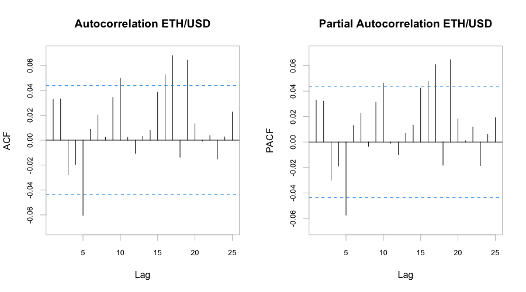

## 3. Methods {#methods}

This section covers how to define a trading strategy from the trained networks. It is also dedicated to the topic of how the performance is evaluated. 

### 3.1. Data exploration

First, we will explore the the development of ETH over time. Figure \ref{fig:eth_exploration} shows the price, the logarithmic price and the logarithmic return. The logarithmic price is used to better compare the changes from the price as the relative change becomes visible. The same is true for the log return which shows stationarity. In the first two plots the local peaks are well visible, which reached a then ATH (All-Time High) of USD 1313 in January 2018. It can also be seen that we are in a bull run at the time of writing this paper. In the logarithmized return, it can be seen that the volatility is not constant and thus shows volatility clusters.

&nbsp;

```{r eth_exploration, fig.align='center', out.width='80%', fig.cap='Time plot of the price, logarithmized price and logarithmized return based on the price for ETH/USD. Large (crypto) market phase dependencies and volatility persistence are evident.', echo=FALSE, fig.width = 8, fig.height = 6.5}
# knitr::include_graphics("images/eth_exploration.png")
# 
load("data/ETH_2021-05-05.rda")
ETH <- ETH["::2021-04-30"]
logret <- diff(log(ETH$`ETH-USD.Close`))
logret <- na.omit(logret)
colnames(logret) <- "ETH Log Returns"
par(mfrow = c(3,1))
plot(ETH$`ETH-USD.Close`, col = 1, main = "ETH/USD", lwd = 0.7)
plot(log(ETH$`ETH-USD.Close`), col = 1, main = "Logarithmic ETH/USD", lwd = 0.7)
plot(logret, col = 1, main = "Logarithmic Returns ETH/USD", lwd = 0.7)
```
\newpage

Continuing with the autocorrelation (ACF) and partial autocorrelation (PACF), we notice a dependency structure in both cases. The ACF plot in figure \ref{fig:dependency} show that lags 5, 10, 16, 17 and 19 are significantly stronger than just white noise. Similarly, lags 5, 10, 16, 17 and 19 are significant in the PACF plot. This information should be kept in mind when choosing the optimal network architecture of the neural network as it seemingly makes sense to include enough data points. 

&nbsp;

```{r dependency, fig.align='center', out.width='80%', fig.cap='Autocorrelation and partial autocorrelation of logarithmic return of the ETH/USD-Prices.', echo=FALSE, fig.width = 7, fig.height = 4.5}
# knitr::include_graphics("images/dependency.png")
# 
par(mfrow = c(1,2))
ACFplot(logret, ymax = 0.07, maxlag = 25, main = "Autocorrelation ETH/USD")
PACFplot(logret, ymax = 0.07, maxlag = 25, main = "Partial Autocorrelation ETH/USD")
```

&nbsp;

Optimization of the ETH with the `auto.arima` function from the package `forecast` indicates that it could be modeled by an ARMA(3,3). However, occasional volatility clustering of the standardized residuals may suggest that model assumptions for the error term (white noise) are possibly violated. Since we are working with neural networks, we will deal with the network architecture next. 

\newpage

### 3.1. Neural Network Architecture

```{r meanplot1, fig.align='center', out.width='100%', fig.cap='asdasdasd', echo=FALSE, fig.width = 12, fig.height = 8}
load("data/mean_ffn.rda")
load("data/mean_rnn.rda")
load("data/mean_lstm.rda")
load("data/mean_gru.rda")
load("data/data_obj.rda")


par_default <- par(no.readonly = TRUE)
par(mfrow=c(2,1), mar=c(4,5,3,2))
plot(mean_ffn$mse_in,
     type="l",
     ylab="MSE In-Sample",
     xlab="",
     xaxt="n",
     main="Neuron-Layer Combination: ETH/USD",
     frame.plot = FALSE,
     ylim=c(min(mean_ffn$mse_in, mean_rnn$mse_in, mean_lstm$mse_in, mean_gru$mse_in),
            max(mean_ffn$mse_in, mean_rnn$mse_in, mean_lstm$mse_in, mean_gru$mse_in)))
lines(mean_rnn$mse_in, col=2)
lines(mean_lstm$mse_in, col=3)
lines(mean_gru$mse_in, col=4)
axis(1, at=c(1, 110, 222, 444, 666, 888, 1110),
     labels=c("(1)", "(10,10)", "(2,2,2)","(4,4,4)", "(6,6,6)", "(8,8,8)", "(10,10,10)"))
rect(xleft=1,
     xright=10,
     ybottom=par('usr')[3],
     ytop=par('usr')[4],
     col="#FF00001A")

rect(xleft=11,
     xright=110,
     ybottom=par('usr')[3],
     ytop=par('usr')[4],
     col="#00FFFF1A")

rect(xleft=111,
     xright=1110,
     ybottom=par('usr')[3],
     ytop=par('usr')[4],
     col="#8000FF1A")


plot(mean_ffn$mse_out,
     type="l",
     ylab="MSE Out-of-Sample",
     xlab="",
     xaxt="n",
     frame.plot = FALSE,
     ylim=c(min(mean_ffn$mse_out, mean_rnn$mse_out, mean_lstm$mse_out, mean_gru$mse_out),
            max(mean_ffn$mse_out, mean_rnn$mse_out, mean_lstm$mse_out, mean_gru$mse_out)))
lines(mean_rnn$mse_out, col=2)
lines(mean_lstm$mse_out, col=3)
lines(mean_gru$mse_out, col=4)
axis(1, at=c(1, 110, 222, 444, 666, 888, 1110),
     labels=c("(1)", "(10,10)", "(2,2,2)","(4,4,4)", "(6,6,6)", "(8,8,8)", "(10,10,10)"))
rect(xleft=1,
     xright=10,
     ybottom=par('usr')[3],
     ytop=par('usr')[4],
     col="#FF00001A")

rect(xleft=11,
     xright=110,
     ybottom=par('usr')[3],
     ytop=par('usr')[4],
     col="#00FFFF1A")

rect(xleft=111,
     xright=1110,
     ybottom=par('usr')[3],
     ytop=par('usr')[4],
     col="#8000FF1A")
par(par_default)

legend("right", legend = c("FFN", "RNN", "LSTM", "GRU"), lty=1, pt.cex=2, cex=0.8, bty='n',
       col = 1:4, horiz=TRUE)
legend("left", legend=c("1 Layer", '2 Layers', '3 Layers'), pch=15, pt.cex=2, cex=0.8, bty='n',
       col = c('#FF00001A', '#00FFFF1A', '#8000FF1A'), horiz=TRUE)
legend("left", legend=c("1 Layer", '2 Layers', '3 Layers'), pch=15, pt.cex=2, cex=0.8, bty='n',
       col = c('#FF00001A', '#00FFFF1A', '#8000FF1A'), horiz=TRUE)
```


\newpage


```{r meanplot2, fig.align='center', out.width='100%', fig.cap='asdasdasd', echo=FALSE, fig.width = 12, fig.height = 8}
# MSE-Plots ohne FFN####
par_default <- par(no.readonly = TRUE)
par(mfrow=c(2,1), mar=c(4,5,3,2))
plot(mean_rnn$mse_in,
     type="l",
     ylab="MSE In-Sample",
     xlab="",
     main="Neuron-Layer Combination: ETH/USD",
     col=2,
     xaxt="n",
     frame.plot = FALSE,
     ylim=c(min(mean_rnn$mse_in, mean_lstm$mse_in, mean_gru$mse_in),
            max(mean_rnn$mse_in, mean_lstm$mse_in, mean_gru$mse_in)))
lines(mean_lstm$mse_in, col=3)
lines(mean_gru$mse_in, col=4)
axis(1, at=c(1, 110, 222, 444, 666, 888, 1110),
     labels=c("(1)", "(10,10)", "(2,2,2)","(4,4,4)", "(6,6,6)", "(8,8,8)", "(10,10,10)"))
rect(xleft=1,
     xright=10,
     ybottom=par('usr')[3],
     ytop=par('usr')[4],
     col="#FF00001A")

rect(xleft=11,
     xright=110,
     ybottom=par('usr')[3],
     ytop=par('usr')[4],
     col="#00FFFF1A")

rect(xleft=111,
     xright=1110,
     ybottom=par('usr')[3],
     ytop=par('usr')[4],
     col="#8000FF1A")

plot(mean_rnn$mse_out,
     type="l",
     ylab="MSE Out-of-Sample",
     xlab="",
     col=2,
     xaxt="n",
     frame.plot = FALSE,
     ylim=c(min(mean_rnn$mse_out, mean_lstm$mse_out, mean_gru$mse_out),
            max(mean_rnn$mse_out, mean_lstm$mse_out, mean_gru$mse_out)))
lines(mean_lstm$mse_out, col=3)
lines(mean_gru$mse_out, col=4)
axis(1, at=c(1, 110, 222, 444, 666, 888, 1110),
     labels=c("(1)", "(10,10)", "(2,2,2)","(4,4,4)", "(6,6,6)", "(8,8,8)", "(10,10,10)"))
rect(xleft=1,
     xright=10,
     ybottom=par('usr')[3],
     ytop=par('usr')[4],
     col="#FF00001A")

rect(xleft=11,
     xright=110,
     ybottom=par('usr')[3],
     ytop=par('usr')[4],
     col="#00FFFF1A")

rect(xleft=111,
     xright=1110,
     ybottom=par('usr')[3],
     ytop=par('usr')[4],
     col="#8000FF1A")

par(par_default)
legend("right", legend = c("RNN", "LSTM", "GRU"), lty=1, pt.cex=2, cex=0.8, bty='n',
       col = 2:4, horiz=TRUE)
legend("left", legend=c("1 Layer", '2 Layers', '3 Layers'), pch=15, pt.cex=2, cex=0.8, bty='n',
       col = c('#FF00001A', '#00FFFF1A', '#8000FF1A'), horiz=TRUE)
legend("left", legend=c("1 Layer", '2 Layers', '3 Layers'), pch=15, pt.cex=2, cex=0.8, bty='n',
       col = c('#FF00001A', '#00FFFF1A', '#8000FF1A'), horiz=TRUE)
```


\newpage

```{r sharpeplot, fig.align='center', out.width='100%', fig.cap='asdasdasd', echo=FALSE, fig.width = 12, fig.height = 8}
# Sharpe-Plots####
perf_in <- as.numeric(data_obj$target_in)
perf_out <- as.numeric(data_obj$target_out)
sharpe_bnh_in <- as.numeric(sqrt(365)*mean(perf_in)/sqrt(var(perf_in)))
sharpe_bnh_out <- as.numeric(sqrt(365)*mean(perf_out)/sqrt(var(perf_out)))
par_default <- par(no.readonly = TRUE)
par(mfrow=c(2,1), mar=c(4,5,3,2))
plot(mean_ffn$sharpe_in,
     type="l",
     ylab="Sharpe In-Sample",
     xlab="",
     main="Neuron-Layer Combination: ETH/USD",
     xaxt="n",
     frame.plot = FALSE,
     ylim=c(min(mean_ffn$sharpe_in, mean_rnn$sharpe_in, mean_lstm$sharpe_in, mean_gru$sharpe_in),
            max(mean_ffn$sharpe_in, mean_rnn$sharpe_in, mean_lstm$sharpe_in, mean_gru$sharpe_in)))
lines(mean_rnn$sharpe_in, col=2)
lines(mean_lstm$sharpe_in, col=3)
lines(mean_gru$sharpe_in, col=4)
abline(h=sharpe_bnh_in, lty=3, col=8)
axis(1, at=c(1, 110, 222, 444, 666, 888, 1110),
     labels=c("(1)", "(10,10)", "(2,2,2)","(4,4,4)", "(6,6,6)", "(8,8,8)", "(10,10,10)"))
rect(xleft=1,
     xright=10,
     ybottom=par('usr')[3],
     ytop=par('usr')[4],
     col="#FF00001A")

rect(xleft=11,
     xright=110,
     ybottom=par('usr')[3],
     ytop=par('usr')[4],
     col="#00FFFF1A")

rect(xleft=111,
     xright=1110,
     ybottom=par('usr')[3],
     ytop=par('usr')[4],
     col="#8000FF1A")

plot(mean_ffn$sharpe_out,
     type="l",
     ylab="Sharpe Out-of-Sample",
     xlab="",
     xaxt="n",
     frame.plot = FALSE,
     ylim=c(min(mean_ffn$sharpe_out, mean_rnn$sharpe_out, mean_lstm$sharpe_out, mean_gru$sharpe_out),
            max(mean_ffn$sharpe_out, mean_rnn$sharpe_out, mean_lstm$sharpe_out, mean_gru$sharpe_out)))
lines(mean_rnn$sharpe_out, col=2)
lines(mean_lstm$sharpe_out, col=3)
lines(mean_gru$sharpe_out, col=4)
abline(h=sharpe_bnh_out, lty=3, col=8)
axis(1, at=c(1, 110, 222, 444, 666, 888, 1110),
     labels=c("(1)", "(10,10)", "(2,2,2)","(4,4,4)", "(6,6,6)", "(8,8,8)", "(10,10,10)"))
rect(xleft=1,
     xright=10,
     ybottom=par('usr')[3],
     ytop=par('usr')[4],
     col="#FF00001A")

rect(xleft=11,
     xright=110,
     ybottom=par('usr')[3],
     ytop=par('usr')[4],
     col="#00FFFF1A")

rect(xleft=111,
     xright=1110,
     ybottom=par('usr')[3],
     ytop=par('usr')[4],
     col="#8000FF1A")

par(par_default)
legend("right", legend = c("FFN", "RNN", "LSTM", "GRU", "BnH-Sharpe"), lty=c(1,1,1,1,3), pt.cex=2, cex=0.8, bty='n',
       col = c(1,2,3,4,8), horiz=TRUE)
legend("left", legend=c("1 Layer", '2 Layers', '3 Layers'), pch=15, pt.cex=2, cex=0.8, bty='n',
       col = c('#FF00001A', '#00FFFF1A', '#8000FF1A'), horiz=TRUE)
legend("left", legend=c("1 Layer", '2 Layers', '3 Layers'), pch=15, pt.cex=2, cex=0.8, bty='n',
       col = c('#FF00001A', '#00FFFF1A', '#8000FF1A'), horiz=TRUE)
```